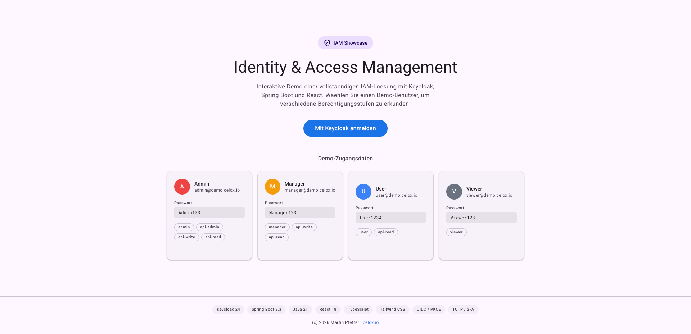
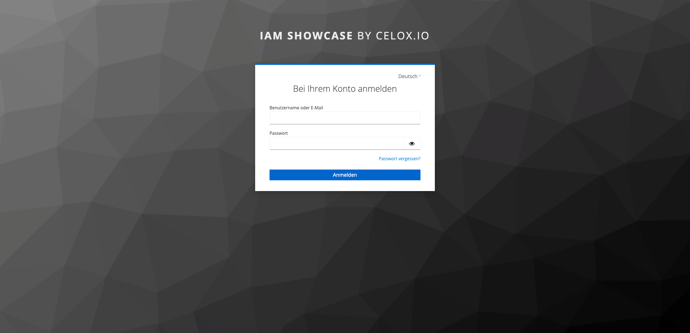
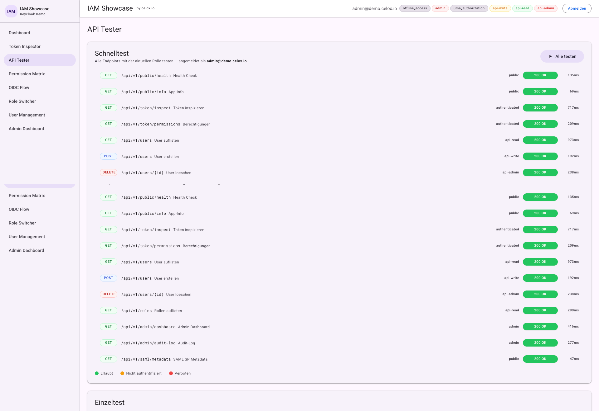
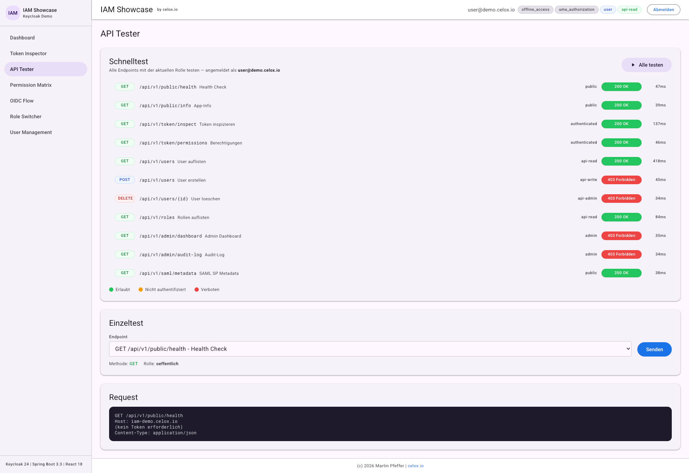
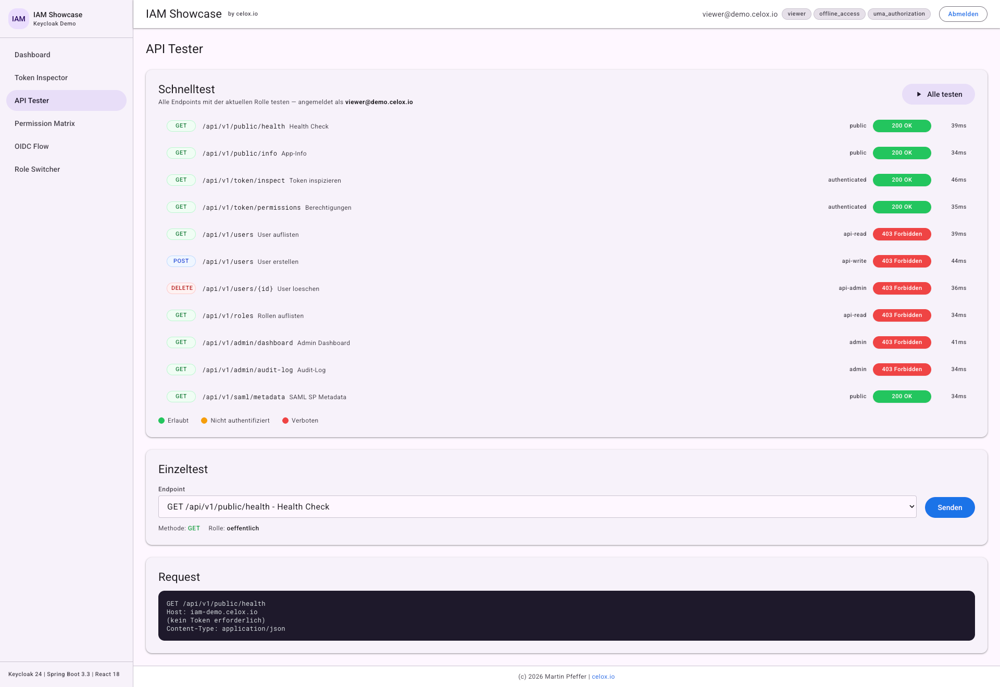
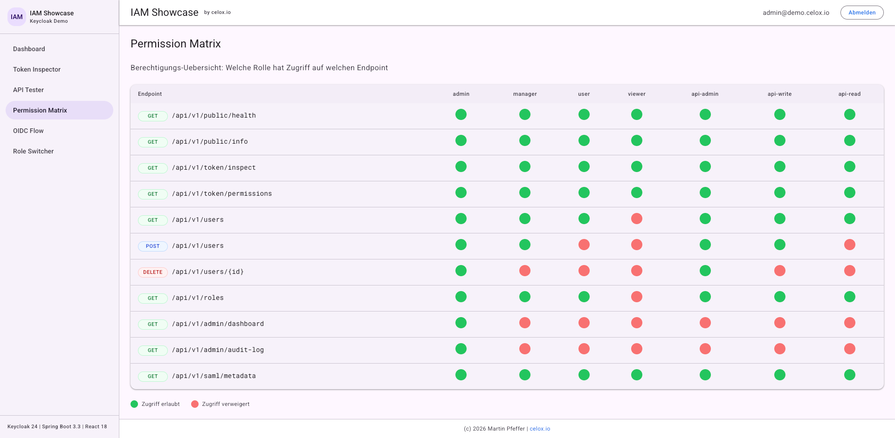

# IAM Showcase Keycloak

[](https://github.com/pepperonas/iam-showcase-keycloak/actions/workflows/ci.yml)


**Live Demo:** [https://iam-demo.celox.io](https://iam-demo.celox.io)

Ein vollstaendiges Identity & Access Management Showcase-Projekt, das Keycloak-basiertes SSO, OAuth2/OIDC, SAML2, RBAC und 2FA (TOTP) in einer modernen Architektur demonstriert.



## Inhaltsverzeichnis

- [Demo-Credentials](#demo-credentials)
- [Quick Start](#quick-start)
- [Architektur](#architektur)
  - [Uebersicht](#uebersicht)
  - [Komponenten](#komponenten)
  - [Datenfluss: Login](#datenfluss-login)
  - [Datenfluss: API-Call](#datenfluss-api-call)
  - [Deployment-Optionen](#deployment-optionen)
- [Security-Konzepte](#security-konzepte)
  - [OAuth2 / OpenID Connect](#oauth2--openid-connect)
  - [SAML 2.0 (Konzept-Demo)](#saml-20-konzept-demo)
  - [Multi-Faktor-Authentifizierung (2FA)](#multi-faktor-authentifizierung-2fa)
  - [Role-Based Access Control (RBAC)](#role-based-access-control-rbac)
  - [JWT-Verarbeitung](#jwt-verarbeitung)
  - [API-Sicherheit](#api-sicherheit)
  - [Password Policy](#password-policy)
  - [Audit-Logging](#audit-logging)
- [API-Referenz](#api-referenz)
  - [Oeffentliche Endpoints](#oeffentliche-endpoints)
  - [Token Endpoints](#token-endpoints)
  - [User Management](#user-management)
  - [Rollen](#rollen)
  - [Admin](#admin)
  - [SAML](#saml)
  - [Token beziehen](#token-beziehen)
- [Keycloak Konfiguration](#keycloak-konfiguration)
  - [Clients](#clients)
  - [Rollen-Modell](#rollen-modell)
  - [Sicherheits-Konfiguration](#sicherheits-konfiguration)
  - [Custom SPI: Audit Event Listener](#custom-spi-audit-event-listener)
- [Testing](#testing)
  - [Backend (Java/Spring Boot)](#backend-javaspring-boot)
  - [Frontend (React/TypeScript)](#frontend-reacttypescript)
  - [Ausfuehrung](#ausfuehrung)
- [Deployment](#deployment)
  - [Lokale Entwicklung (Docker Compose)](#lokale-entwicklung-docker-compose)
  - [VPS Deployment (Produktion)](#vps-deployment-produktion)
  - [Kubernetes (Helm)](#kubernetes-helm)
- [Showcase Features](#showcase-features)
  - [Skills-Matrix](#skills-matrix)
  - [Frontend Showcase-Features](#frontend-showcase-features)
- [Lizenz](#lizenz)

---

## Demo-Credentials

| User | Passwort | Rollen |
|------|----------|--------|
| `admin@demo.celox.io` | `Admin123` | admin, api-admin, api-write, api-read |
| `manager@demo.celox.io` | `Manager123` | manager, api-write, api-read |
| `user@demo.celox.io` | `User1234` | user, api-read |
| `viewer@demo.celox.io` | `Viewer123` | viewer |

## Quick Start

```bash
# Repository klonen
git clone https://github.com/pepperonas/iam-showcase-keycloak.git
cd iam-showcase-keycloak

# Alle Services starten
docker compose -f docker/docker-compose.yml up -d

# Warten bis Keycloak bereit ist (~30s)
# Frontend: http://localhost:5173
# Backend API: http://localhost:8080/api/v1/public/health
# Keycloak: http://localhost:8180
```

---

## Architektur

### Uebersicht

```
                    +-------------------+
                    |     Browser       |
                    +--------+----------+
                             |
                    OIDC/PKCE Auth Flow
                             |
              +--------------+--------------+
              |                             |
    +---------v----------+       +----------v---------+
    |    React SPA       |       |     Keycloak       |
    |  (Vite + TS + TW)  |       |  (Auth Server)     |
    |  Port 5173/80      |       |  Port 8180         |
    +---------+----------+       +----------+----------+
              |                             |
         Bearer JWT                    JDBC (Realm DB)
              |                             |
    +---------v----------+       +----------v---------+
    |  Spring Boot API   |       |  PostgreSQL        |
    |  (Resource Server) |       |  (Keycloak DB)     |
    |  Port 8080         |       |  Port 5432         |
    +---------+----------+       +--------------------+
              |
           JDBC
              |
    +---------v----------+
    |  PostgreSQL        |
    |  (App DB)          |
    |  Port 5432         |
    +--------------------+
```

### Komponenten

**Keycloak (Identity Provider)**
- **Realm:** `iam-showcase`
- **Protokolle:** OIDC, SAML 2.0
- **Features:** SSO, RBAC, TOTP/2FA, Brute-Force-Schutz
- **Custom SPI:** Audit Event Listener fuer strukturiertes Logging

**Spring Boot Backend (Resource Server)**
- **Security:** OAuth2 Resource Server mit JWT-Validierung
- **JWT Converter:** Extrahiert Realm- und Client-Rollen
- **API:** RESTful mit Versionierung (`/api/v1/`)
- **Persistenz:** JPA + Flyway Migration

**React Frontend (SPA)**
- **Auth:** OIDC Authorization Code + PKCE via `react-oidc-context`
- **Routing:** React Router v6 mit rollenbasierten Guards
- **API:** Axios mit Token-Interceptor

### Datenfluss: Login

1. User klickt "Anmelden" im SPA
2. SPA generiert `code_verifier` + `code_challenge` (PKCE)
3. Redirect zu Keycloak mit `code_challenge`
4. User authentifiziert sich (Passwort + optional TOTP)
5. Keycloak redirectet mit Authorization Code
6. SPA tauscht Code + `code_verifier` gegen Tokens
7. Access Token (JWT) wird fuer API-Calls verwendet

### Datenfluss: API-Call

1. SPA sendet Request mit `Authorization: Bearer <JWT>`
2. Spring Security validiert JWT-Signatur via JWKS
3. `KeycloakJwtConverter` extrahiert Rollen
4. RBAC-Check gegen `SecurityConfig`
5. Response wird zurueckgegeben

### Deployment-Optionen

| Umgebung | Methode | Config |
|----------|---------|--------|
| Lokal | Docker Compose | `docker/docker-compose.yml` |
| VPS | Docker Compose + Nginx | `docker-compose.prod.yml` |
| Kubernetes | Helm Chart | `helm/iam-showcase/` |

---

## Security-Konzepte

### OAuth2 / OpenID Connect

- **Flow:** Authorization Code mit PKCE (S256)
- **Client-Typ:** Public Client (SPA) - kein Client Secret
- **Token-Typ:** JWT (RS256 signiert)
- **Token-Lebensdauer:** Access 5 Min, Refresh 30 Min, SSO Session 8 Std.
- **Silent Renew:** Automatische Token-Erneuerung im Hintergrund



### SAML 2.0 (Konzept-Demo)

- SAML-Client in Keycloak konfiguriert (`iam-saml-client`)
- SP Metadata XML Endpoint (`/api/v1/saml/metadata`)
- Assertion Consumer Service URL konfiguriert
- Signierte Assertions (RSA-SHA256)

### Multi-Faktor-Authentifizierung (2FA)

- **Methode:** TOTP (Time-based One-Time Password)
- **Konfiguration:** 6 Ziffern, 30 Sekunden Intervall
- **Algorithmus:** HMAC-SHA1
- **Kompatible Apps:** Google Authenticator, FreeOTP, Microsoft Authenticator

### Role-Based Access Control (RBAC)

**Realm-Rollen:**

| Rolle | Beschreibung |
|-------|-------------|
| admin | Vollzugriff auf alle Funktionen |
| manager | Verwaltung von Benutzern und Ressourcen |
| user | Standard-Benutzerrolle |
| viewer | Nur-Lese-Zugriff |

**Client-Rollen (iam-backend):**

| Rolle | Beschreibung |
|-------|-------------|
| api-admin | Administrative API-Rechte (DELETE) |
| api-write | Schreibrechte (POST, PUT) |
| api-read | Leserechte (GET) |

### JWT-Verarbeitung

1. Keycloak stellt JWT mit `realm_access.roles` und `resource_access.iam-backend.roles`
2. `KeycloakJwtConverter` extrahiert beide Rollen-Sets
3. Mapping auf Spring Security `GrantedAuthority` mit `ROLE_` Prefix
4. `SecurityConfig` definiert URL-basierte RBAC-Regeln

### API-Sicherheit

- CSRF deaktiviert (Stateless API mit JWT)
- CORS konfiguriert (nur erlaubte Origins)
- Session: STATELESS
- Rate-Limiting via Keycloak Brute-Force-Schutz

### Password Policy

- Mindestens 8 Zeichen
- Mindestens 1 Grossbuchstabe
- Mindestens 1 Ziffer

### Audit-Logging

- Custom Keycloak SPI Event Listener
- Strukturiertes JSON-Logging aller Auth-Events
- Anwendungsseitiges Audit-Log fuer API-Zugriffe

---

## API-Referenz

Basis-URL: `http://localhost:8080/api/v1`

Swagger UI: `http://localhost:8080/swagger-ui.html`

### Oeffentliche Endpoints

**GET /public/health** - Health Check, kein Token erforderlich.
```bash
curl http://localhost:8080/api/v1/public/health
```
Response: `{"status":"UP","timestamp":"2026-01-01T00:00:00Z"}`

**GET /public/info** - Anwendungsinformationen.
```bash
curl http://localhost:8080/api/v1/public/info
```

### Token Endpoints

**GET /token/inspect** - Decodiertes JWT mit Header, Claims, Rollen, Ablaufzeit.
```bash
curl -H "Authorization: Bearer <TOKEN>" http://localhost:8080/api/v1/token/inspect
```

**GET /token/permissions** - Effektive Berechtigungen und Permission Matrix.
```bash
curl -H "Authorization: Bearer <TOKEN>" http://localhost:8080/api/v1/token/permissions
```

### User Management

**GET /users** - Paginierte Benutzerliste. Rolle: `api-read`
```bash
curl -H "Authorization: Bearer <TOKEN>" "http://localhost:8080/api/v1/users?page=0&size=20"
```

**GET /users/{id}** - Benutzer-Details. Rolle: `api-read`

**POST /users** - Benutzer erstellen. Rolle: `api-write`
```bash
curl -X POST -H "Authorization: Bearer <TOKEN>" -H "Content-Type: application/json" \
  -d '{"username":"test","email":"test@demo.de","password":"Test1234","firstName":"Test","lastName":"User"}' \
  http://localhost:8080/api/v1/users
```

**PUT /users/{id}** - Benutzer aktualisieren. Rolle: `api-write`

**DELETE /users/{id}** - Benutzer loeschen. Rolle: `api-admin`

### Rollen

**GET /roles** - Alle Realm- und Client-Rollen. Rolle: `api-read`

### Admin

**GET /admin/dashboard** - Aggregierte Statistiken. Rolle: `admin`

**GET /admin/audit-log** - Paginiertes Audit-Log. Rolle: `admin`

### SAML

**GET /saml/metadata** - SAML Service Provider Metadata XML. Kein Token erforderlich.

### Token beziehen

```bash
TOKEN=$(curl -s -X POST "http://localhost:8180/realms/iam-showcase/protocol/openid-connect/token" \
  -H "Content-Type: application/x-www-form-urlencoded" \
  -d "grant_type=password&client_id=iam-frontend&username=admin@demo.celox.io&password=Admin123" \
  | jq -r '.access_token')
```

---

## Keycloak Konfiguration

### Clients

| Client | Typ | Protokoll | Zweck |
|--------|-----|-----------|-------|
| `iam-frontend` | Public | OIDC | React SPA (PKCE) |
| `iam-backend` | Confidential | OIDC | Spring Boot Resource Server |
| `iam-saml-client` | SAML | SAML 2.0 | Konzept-Demo |

### Rollen-Modell

**Realm-Rollen:** admin, manager, user, viewer

**Client-Rollen (iam-backend):** api-read, api-write, api-admin

**Benutzer-Zuordnung:**

| User | Realm-Rollen | Client-Rollen |
|------|-------------|---------------|
| admin@demo.celox.io | admin | api-admin, api-write, api-read |
| manager@demo.celox.io | manager | api-write, api-read |
| user@demo.celox.io | user | api-read |
| viewer@demo.celox.io | viewer | - |

### Sicherheits-Konfiguration

- **Password Policy:** min 8 Zeichen, 1 Grossbuchstabe, 1 Ziffer
- **OTP:** TOTP, 6 Stellen, 30 Sekunden
- **Brute Force:** Aktiv, max 5 Fehlversuche, 15 Min Sperre
- **Token Lifetimes:** Access 5min, Refresh 30min, SSO 8h

### Custom SPI: Audit Event Listener

- Provider-ID: `celox-audit-listener`
- Loggt: LOGIN, LOGOUT, REGISTER, ERROR Events
- Format: Strukturiertes JSON
- Deployment: JAR in `/opt/keycloak/providers/`

---

## Testing

### Backend (Java/Spring Boot)

**Unit Tests**
- **Framework:** JUnit 5
- **Mocking:** Mockito (Standard) + EasyMock (demonstriert beide Frameworks)
- **Scope:** Services, Converter, DTOs

**Security Tests**
- **Mock JWT:** `@WithMockUser`, `SecurityMockMvcRequestPostProcessors.jwt()`
- **RBAC Tests:** Alle Rollen-Kombinationen gegen alle Endpoints
- **Scope:** SecurityConfig, Zugriffsregeln

**Integration Tests**
- **Testcontainers:** PostgreSQL + Keycloak Container
- **Scope:** Kompletter Request-Lifecycle, DB-Operationen

**Coverage**
- **Tool:** Jacoco Maven Plugin
- **Minimum:** 80% Line Coverage
- **Report:** `backend/target/site/jacoco/`

### Frontend (React/TypeScript)

- **Framework:** Vitest
- **DOM Testing:** @testing-library/react
- **Mocking:** vi.mock fuer OIDC-Context
- **Test-Dateien:** `App.test.tsx`, `PermissionMatrix.test.tsx`, `TokenInspector.test.tsx`

### Ausfuehrung

```bash
# Backend Tests
cd backend && mvn clean verify

# Frontend Tests
cd frontend && npm test

# Alle Tests
mvn clean verify && cd ../frontend && npm test
```

---

## Deployment

### Lokale Entwicklung (Docker Compose)

```bash
# Alle Services starten
docker compose -f docker/docker-compose.yml up -d

# Status pruefen
docker compose -f docker/docker-compose.yml ps

# Logs anzeigen
docker compose -f docker/docker-compose.yml logs -f keycloak

# Services stoppen
docker compose -f docker/docker-compose.yml down
```

**URLs:**
- Frontend: http://localhost:5173
- Backend API: http://localhost:8080/api/v1/public/health
- Keycloak: http://localhost:8180 (Admin: admin/admin)
- Swagger UI: http://localhost:8080/swagger-ui.html

### VPS Deployment (Produktion)

**Voraussetzungen:**
- VPS mit Docker + Docker Compose
- DNS: `iam-demo.celox.io` + `auth.iam-demo.celox.io` -> VPS IP
- SSH-Zugang

```bash
# Auf VPS: Repository klonen
git clone https://github.com/pepperonas/iam-showcase-keycloak.git /opt/iam-showcase-keycloak
cd /opt/iam-showcase-keycloak

# .env erstellen (basierend auf .env.example)
cp .env.example .env
# Sichere Passwoerter setzen!

# Starten mit Produktion-Overrides
docker compose -f docker/docker-compose.yml -f docker/docker-compose.prod.yml up -d

# SSL einrichten
sudo bash scripts/setup-ssl.sh
```

### Kubernetes (Helm)

```bash
# Helm Chart installieren
helm install iam-showcase helm/iam-showcase/ -n iam-showcase --create-namespace

# Produktion
helm install iam-showcase helm/iam-showcase/ -f helm/iam-showcase/values-prod.yaml

# Lint pruefen
helm lint helm/iam-showcase/

# Template rendern
helm template iam-showcase helm/iam-showcase/
```

---

## Showcase Features

### Skills-Matrix

| Kompetenz | Implementierung | Dateien |
|-----------|----------------|---------|
| **Keycloak Administration** | Realm-Konfiguration, Clients, Rollen, Users, Policies | `keycloak/realm-export.json` |
| **OAuth2 / OIDC** | Authorization Code + PKCE, JWT-Validierung, Token-Inspection | `SecurityConfig.java`, `KeycloakJwtConverter.java`, `AuthProvider.tsx` |
| **SAML 2.0** | Keycloak SAML-Client, SP Metadata Endpoint | `realm-export.json`, `SamlController.java` |
| **RBAC** | Realm- + Client-Rollen, URL-basierte Zugriffssteuerung | `SecurityConfig.java`, `ProtectedRoute.tsx` |
| **2FA / MFA** | TOTP Konfiguration (6 Digits, 30s) | `realm-export.json` (OTP Policy) |
| **SSO** | Session-Management, Token-Lifetimes | Keycloak-Konfiguration |
| **Custom SPI** | Event Listener mit strukturiertem Audit-Logging | `AuditEventListenerProvider.java` |
| **Spring Security** | OAuth2 Resource Server, Method Security | `SecurityConfig.java` |
| **React + OIDC** | SPA mit PKCE, rollenbasierte UI | `useAuth.ts`, `Sidebar.tsx` |
| **API Design** | RESTful, Versioniert, Swagger/OpenAPI | Controller-Layer |
| **Testing** | Mockito, EasyMock, Testcontainers, Vitest | `*Test.java`, `*.test.tsx` |
| **Docker** | Multi-Stage Build, Compose Orchestrierung | `Dockerfile`, `docker-compose.yml` |
| **Kubernetes** | Helm Charts, HPA, Ingress, Secrets | `helm/iam-showcase/` |
| **CI/CD** | GitHub Actions, Security Scans | `.github/workflows/` |

### Frontend Showcase-Features

1. **Token Inspector** - JWT visuell decodiert, Expiry-Countdown, Copy-Button
2. **Role Switcher** - One-Click User-Wechsel zwischen 4 Demo-Profilen
3. **API Tester** - Interaktiver Endpoint-Tester mit Batch-Test und visueller Berechtigungsanzeige
4. **Permission Matrix** - Endpoint x Rolle Grid (gruen/rot)
5. **OIDC Flow Diagram** - 10-Schritt Sequenzdiagramm des Auth-Flows
6. **User Management** - CRUD-Interface mit rollenbasierter UI
7. **Admin Dashboard** - Statistiken + Audit-Log

#### API Tester: Admin (alle Endpoints erlaubt)



#### API Tester: User (eingeschraenkte Rechte)



#### API Tester: Viewer (minimale Rechte)



#### Permission Matrix



---

## Tech-Stack

- **Identity Provider:** Keycloak 24 (OAuth2, OIDC, SAML2, TOTP)
- **Backend:** Spring Boot 3.3, Java 21, Spring Security OAuth2 Resource Server
- **Frontend:** React 18, TypeScript, Vite, Tailwind CSS, Material Design 3
- **Datenbank:** PostgreSQL 16
- **Infrastruktur:** Docker Compose, Helm Charts, GitHub Actions
- **Testing:** JUnit 5, Mockito, EasyMock, Testcontainers, Vitest

## Lizenz

MIT License - (c) 2026 Martin Pfeffer | [celox.io](https://celox.io)
